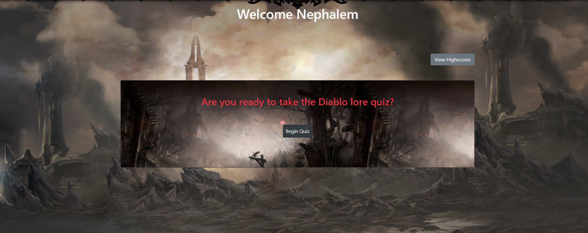
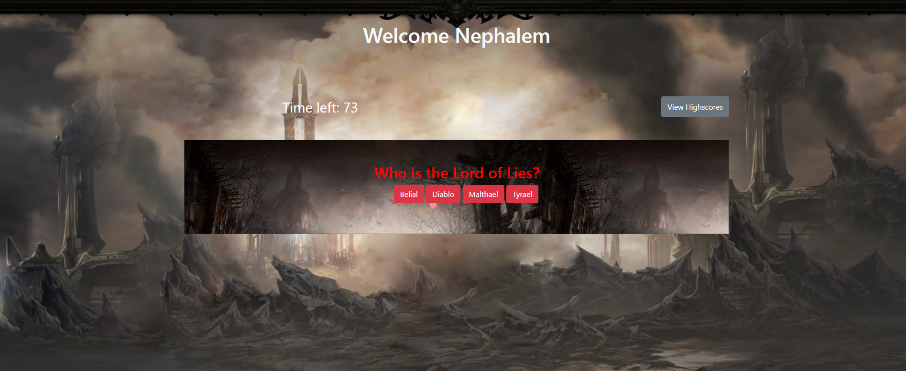
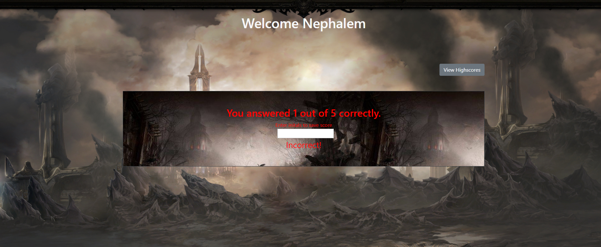
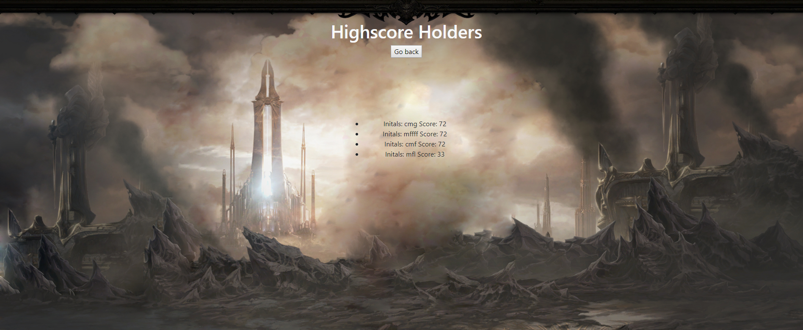

# Diablo-Quiz
This application is a diablo lore quiz. Once started, the user has 75 seconds to answer 5 questions about Diablo lore, once completed, a score is computed based on time left on the clock after all questions are answered, but answering a question wrong removes 15 seconds from the time left, therefore hurting your score.

# Start Screen

# Questions

# Finished Screen

# Highscores Page

# Built With
* HTML
* CSS
* Bootstrap
* Javascript

# Functionality
This program features several different tools of javascript. To begin the quiz, simply click the start button, this triggers a countdown that starts at 75 seconds, and also are prompted with the first question and set of answers. Each answer is clickable and will display if you were right or wrong, then displaying the next question. Once finished, an input box will display, allowing you to enter your intiials and save your score. The scores are stored on a high scores page, which you can visit by clicking view highscores. Enjoy!

# Author
Cassidy Fortner
